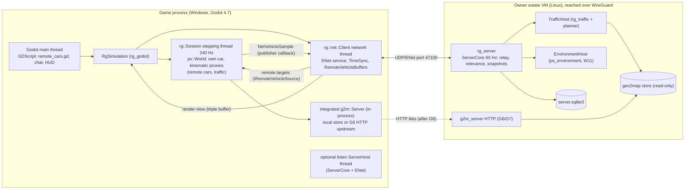

# racing_game game server - implementation plan

Status: PLAN ONLY (2026-10-05). Nothing here is built. Moved into racing_game from physics_sim `out/game_server_plan.md`
(vault RACE-009); section 16.1 holds the owner's binding answers to the open questions. The text below is otherwise
the planning agent's original.

Path convention: bare `CLAUDE.md`, `PLAN.md`, `docs/...`, `core/...` are racing_game's own; paths of the other repos
are named with their repo (`physics_sim CLAUDE.md`, `physics_sim out/weather_plan.md` - that `out/` folder lives in the
physics_sim working tree, not in the `external/physics_sim` submodule). The "docs/game_server.md (setup, ports,
WireGuard peer config pointer, admin basics)" deliverable of increment S9 is a separate, later operator document,
renamed `docs/game_server_setup.md` here - this file is the plan.

Written by a planning agent against:
- racing_game master `597a059` (CLAUDE.md, PLAN.md, docs/npc_traffic.md, docs/npc_truck.md,
  docs/presentation.md, docs/vr_audio.md, `core/include/rg/session.h`, `core/src/session.cpp`
  `Session::update_traffic`, `core/include/rg/npc_traffic.h`, `npc_truck.h`, `environment.h`);
- physics_sim master `c7ee0b4` (CLAUDE.md "Adapter seams", "World tick pipeline", "Vehicle system",
  "Drivetrain"; `out/weather_plan.md` sections 0 (K9), 10, 11, 12 (W11); `ps/world/world.h`,
  `ps/backend/i_rigid_backend.h`, `ps/io/vehicle_io.h`, `core/src/backend/jolt/jolt_backend.cpp`);
- geo2map_engine master `ff65bf7` (PLAN.md section 3 "The map server", `docs/formats/protocol.md`);
- the knowledge vault (search only: G2M-010, G2M-003, PHYS-061, PHYS-053, AGS-019);
- the web (sources in section 17).


## Conventions

Number labels:
- **[M]** measured (where and by whom is named);
- **[C]** cited (source in section 17);
- **[D]** derived (the arithmetic is shown or named);
- **[A]** assumed (a starting value or target; replace it with a measurement in the increment named).

Abbreviations (each defined once, used freely afterwards):

| Abbreviation | Meaning |
|---|---|
| RTT | round-trip time of a network packet |
| UDP | User Datagram Protocol (connectionless datagrams) |
| MTU | maximum transmission unit (largest packet a link carries unfragmented) |
| VPN | virtual private network; here WireGuard on the owner's estate |
| LAN | local area network |
| VM | virtual machine |
| TLS | Transport Layer Security |
| QUIC | the UDP-based transport protocol of RFC 9000 |
| ENet | the "ENet reliable UDP networking library" (MIT licence) |
| GNS | Valve's GameNetworkingSockets library |
| UTM | Universal Transverse Mercator grid (the game's map frame, geo2map PLAN section 4) |
| rid | geo2map release id (64 hex digits, pins the exact map data) |
| SP / MP | single player / multiplayer |
| CI | continuous integration (`tools/ci.ps1`) |
| p50/p95/p99 | 50th/95th/99th percentile |
| `server_us` | the server clock: microseconds since the server process started (int64) |

---------------------------------------------------------------------------------------------

## 0. Summary of the key decisions

| # | Decision | Main reason | Section |
|---|---|---|---|
| G1 | **Client-authoritative own car.** Each client simulates only its own vehicle (as today) and sends its state at 30 Hz; the server relays it; every other client shows that car extrapolated to the present. No server physics, no rollback, no lockstep. | A full vehicle (engine cycle maps, turbo, shaft network, terrain streaming) cannot be rolled back (no World save/restore; Jolt's own RestoreState breaks when bodies or heightfields change) and cannot be lockstepped across far-apart players who stream different terrain. Friends are trusted. | 3 |
| G2 | **Remote cars are kinematic proxy bodies** in each client's World, driven toward the smoothed extrapolated pose. The local car bounces off them; the remote car is not pushed locally. S7 adds an impulse exchange so the other car also reacts (one-way latency late). Player collisions are a server setting (on / off / ghost while overlapping). | Kinematic proxies already exist (NPC traffic), need no new physics, cannot be destabilised by network jitter. Their flaw (an infinitely heavy remote car) is stated honestly in 4.3. | 4 |
| G3 | **Traffic is simulated by the server and replicated** as route segments plus a station/speed stream; clients move the existing kinematic traffic bodies along the received route. The per-tick traffic controller is extracted from `Session` into a World-free library. | Today's traffic is not deterministic (background planning timing, platform libm, camera-frustum retirement), so seeds cannot reproduce it; the server already must know every player's position. Route-following extrapolation makes the replicated traffic accurate in the local present, where the local car collides with it. | 5 |
| G4 | **Relevance by distance around each client's interest points** (car, walker, camera focus): full rate within 2 km, roster at 0.2 Hz beyond. **Wire positions are int32 at 1/1024 m relative to the recipient's integer-km session origin**, plus that origin's UTM zone. | Players are mostly far apart; per-client floating origins already exist for rendering; 1/1024 m over +-2097 km covers one UTM zone [D]. | 6 |
| G5 | **ENet over UDP**, own bit-packed binary protocol with a 16-bit protocol version, no general compression on snapshots (quantisation instead), zstd only for large reliable blobs. Downstream per client 44 / 89 / 133 kbit/s at 10 / 20 / 30 Hz with 8 players, before traffic [D]. | ENet: MIT, Windows/Linux, reliable and unreliable channels, no dependencies; encryption comes from WireGuard. GNS needs OpenSSL + libsodium + protobuf; QUIC needs TLS certificates. | 7 |
| G6 | **One server clock** (`server_us`, 60 Hz server tick). Clients estimate it with ping/pong (minimum-RTT filter), slew it, never step it backwards. Every client state carries the server time it was valid at. Environment time on a client follows the server clock, not its own World tick (which freezes while terrain streams). | Extrapolation of remote cars and the weather plan's EnvironmentSync both need one shared time base. | 8 |
| G7 | **One persistent world per server** (one rid, one weather, one traffic population); join = handshake + EnvironmentSync + condition checkpoint + roster; persistence in one SQLite file; admin commands via the server console and an in-game `/admin` channel; config file `rg.server/1`. | Friends drop in and out; geo2map already vendors SQLite. | 9 |
| G8 | **Three deployments, one code path** (mirrors geo2map PLAN 3.1): integrated listen server inside the game process, dedicated `rg_server` on the estate VM, any custom endpoint. The game server and the geo2map map server are separate services; `rg_server` reads the map store read-only in-process for traffic planning. No TLS inside WireGuard. | Same library everywhere; separate failure domains; map data is large and has its own release discipline. | 10 |
| G9 | **Text chat only.** No in-game voice (use an external voice app). | Voice is a large feature (codec, echo cancellation, spatialisation) with no gameplay value for friends who already use a voice app. | 11 |
| G10 | **Tests run on a virtual clock and an in-memory transport with seeded impairment**; bots are headless `rg_core` Sessions plus the net client; desync detection by content and environment hashes; topic tag `[net]`; golden wire bytes compared Windows/Linux. | Deterministic, fast-forwardable network tests that fit the physics_sim CI style. | 12 |

Increments S1-S8 (section 13). S1 is playable: two players on a LAN see each other drive.
physics_sim seams N1-N5 (section 14); none adds networking code to physics_sim.

---------------------------------------------------------------------------------------------

## 1. Scope and non-goals

In scope:
- Players connect to a server, see each other's cars (and walkers) live, can collide.
- Weather and time of day: server authoritative description, clients derive the state (weather plan 11).
- Ambient traffic shared by all players.
- Join, leave, late join, persistence of player positions and vehicle choice, admin commands.
- Three deployments; testing; CI.

Non-goals (owner rulings or recommended):
- Public matchmaking, accounts, sign-up, CDN, anti-cheat beyond input validation (owner ruling: friends).
- Server-side vehicle physics, rollback, lockstep (rejected in section 3).
- Voice chat (section 11).
- Taking over another player's car or an NPC (NPC takeover is unsupported in SP too: traffic has no drivetrain).
- Events, races, lap timing - later game features; the protocol reserves message ids for them.
- VR-specific networking: VR changes only the local camera; nothing to replicate.
- Engine sound of remote cars from the live voice: the live pipe voice costs about 0.66 of a core per car
  [M, physics_sim CLAUDE.md `vehicle_voice.h`]. Remote cars get sound only once a baked audio bank
  exists (owner memory "engine sound is baked"); until then they are silent or use tyre audio only.

---------------------------------------------------------------------------------------------

## 2. Architecture and ownership

### 2.1 Who owns what

| Component | Repo / target | Contents | Networking code? |
|---|---|---|---|
| `rg_core` (exists) | racing_game `core/` | `Session` (one `ps::World`), player modes, walker, traffic planner, `WorldTerrain` | No. Gains two data seams: a net-sample publisher and a remote-vehicle source (S1/S2), plus a replicated traffic mode (S5). |
| `rg_traffic` (new, S5) | racing_game `core/` (same target or a sibling static library) | The per-tick traffic controller, World-free: actor list, route following, spacing, spawn/retire rules behind an `ITrafficWorld` query interface | No |
| `rg_net` (new, S1) | racing_game `net/` | bit stream, quantisation, protocol messages, `ITransport` (ENet and in-memory), clocks, time sync, remote-vehicle buffers, `Client`, `ServerCore` | Yes (the only place) |
| `rg_server` (new, S1) | racing_game `server/` | headless executable: config, `ServerCore` on a steady-clock loop, console, persistence (S4), traffic host (S5), environment host (S6) | via `rg_net` |
| `rg_bot` (new, S1) | racing_game `tools/rg_bot/` | headless client: flat or synthetic-terrain `Session` + `DriveScript` + `rg_net::Client` | via `rg_net` |
| `rg_godot` (exists) | racing_game `godot_ext/` | binds `RgSimulation.net_*`; owns one `rg::net::Client` and optionally a listen `ServerHost` | No (calls `rg_net`) |
| GDScript | racing_game `game/scripts/` | remote car/walker visuals, chat line, server browser fields | No |
| physics_sim | `ps_core`, `ps_environment(_io)` | data/seam APIs only (section 14); W11 environment sync | **Never** (owner ruling) |
| geo2map_engine | `g2m_server`, later `g2m_http` (G6) | map tiles; one rid per MP session (geo2map PLAN 3.6, decision D12) | its own HTTP protocol, unchanged |

Dependency direction: `rg_net -> rg_core -> ps_core / g2m_*`. `rg_core` never includes an `rg_net` header.
The server links `rg_core` too (for `WorldTerrain`, traffic planning and the shared sample types). That pulls
`ps_core` and Jolt into `rg_server`; acceptable (static, headless, no Godot). Splitting `rg_core` into a
World-free part is possible later and not needed for any increment here.

### 2.2 Process and thread diagram



### 2.3 Data flow per tick (client)

1. Stepping thread, after `World::step()`: `post_step` builds the `FrameSnapshot` (exists) and calls the
   net-sample publisher with a compact `NetVehicleSample` (S1 seam, same pattern as the existing
   `set_engine_audio_publisher`, `session.cpp` `post_step`).
2. Network thread: every 8th sample (240/30 Hz) is stamped with the estimated server time, quantised and
   sent unreliably. Received snapshots go into per-player `RemoteVehicleBuffer`s.
3. Stepping thread, before `World::step()` (S2): asks the `IRemoteVehicleSource` for each remote car's
   smoothed pose at "now" and drives its kinematic proxy with `set_motion` (as traffic does today).
4. Godot main thread, every frame: samples the same buffers at frame time for rendering (S1), so
   rendering never waits for a physics tick and keeps moving while the local World is frozen by
   terrain streaming.

The existing `TripleBuffer<FrameSnapshot>` is single-reader (the Godot thread); the net client must
**not** read it - hence the publisher callback.

---------------------------------------------------------------------------------------------

## 3. Decision 1: authority model for player vehicles

### 3.1 Facts that decide it

- Physics runs at 240 Hz with 960 Hz substeps [C, physics_sim CLAUDE.md]. One tick budget is 4.17 ms
  [D: 1/240 s]; racing_game already logs ticks over 8 ms as spikes [C, racing_game CLAUDE.md].
- A vehicle's full state is large and partly internal: chassis pose/twist in Jolt (plus Jolt's contact
  cache), per-wheel suspension compression and slip-relaxation state, shaft-network node omegas,
  friction-row stick flags and LCP sets, topology state, lagged mesh-loss multipliers, gearbox/clutch/TCU
  state, engine state machine and idle integrator, simulated-engine and turbo state (wastegate PID
  integral, anti-lag hold), fuel tank and N2O bottle, aero actuator state [C, physics_sim CLAUDE.md
  "World tick pipeline" and "Drivetrain"]. physics_sim has **no** World save/restore API today.
- Jolt can save and restore its own state for rollback, but its documentation states that adding or
  removing bodies between the saved and the current frame makes `RestoreState` fail [C, Jolt
  Architecture.md "Rolling back a simulation"]. Terrain streaming rewrites heightfield bodies every few
  hundred metres (`update_heightfield_body`), and traffic creates/destroys bodies continuously.
- physics_sim is bit-deterministic across worker counts and Windows/Linux (hash-compared in CI) [C].
- Players are usually far apart, each streaming different terrain around a different floating origin.
- Friends play over the internet through WireGuard: assume 20-60 ms RTT within Germany and 5-30 ms
  jitter [A; replace with measured RTT in S3].
- One vehicle tick of `car_hyper` costs an unmeasured amount; assume 0.3-1.0 ms including its generated
  engine maps and turbo [A; S2 measures it with `RG_WORLD_CSV` `stage.vehicle_islands_substep.ms`].

### 3.2 Alternatives

**A. Client-authoritative own car, server relay, remote cars extrapolated (state synchronisation without
remote simulation).** Each client owns its car's physics; the server forwards states; receivers show remote
cars dead-reckoned to the present with error smoothing.
- Pro: zero input latency for the own car (feels exactly like SP); no physics on the server; no new physics
  seams for state transfer; players far apart cost only a few bytes; a client whose terrain gate freezes
  affects nobody else; SP and MP use the same `Session` code path.
- Contra: a client can lie (acceptable for friends; the server still validates ranges); car-to-car contact
  is resolved on each side separately (section 4); remote cars are only as accurate as extrapolation over
  the one-way latency (estimated error in 3.3).

**B. Server-authoritative physics with client prediction and rollback** (the Rocket League and Overwatch
pattern [C]: the server simulates everything; clients predict, and on a correction rewind and replay
their inputs).
- Pro: one truth; fair contact; cheat-resistant.
- Contra (decisive):
  - the server must run a `ps::World` with terrain resident around **every** player, worldwide - one
    terrain streamer, tile pool and g2m fetch path per player area, at 240 Hz;
  - rollback needs a full World snapshot/restore covering Jolt, terrain pool contents, every vehicle
    subsystem above and the environment - a large new physics_sim seam that Jolt itself cannot provide
    while bodies and heightfields change;
  - replay cost: at 100 ms RTT a correction replays 24 ticks [D: 0.1 s x 240 Hz]; at the assumed
    0.3-1.0 ms per tick that is 7-24 ms of CPU for one correction of one car [D], i.e. 2-6 tick budgets;
  - the own car would feel the server's corrections at every tyre-slip difference unless the client
    prediction is bit-identical, which requires the exact same terrain bytes and timing on both sides.

**C. Deterministic lockstep** (every peer simulates every car from the same inputs [C, Fiedler]).
- Pro: tiny bandwidth (inputs only); our bit-determinism is a real asset here.
- Contra (decisive): every client must simulate every car and stream every other player's terrain
  (players far apart multiply the work); the simulation can only advance when the inputs for that frame
  have arrived, so everyone waits for the slowest peer [C, Fiedler] - and our terrain gate freezes a
  client for seconds while tiles load, which would freeze every player; late join needs a full state
  transfer (no restore API); input delay of at least half an RTT on the own car.

### 3.3 Recommendation: A

Chosen because it is the only option that keeps the own car identical to SP, needs no physics on the
server, and scales with far-apart players at almost no cost. Its weaknesses are confined to close
interaction, which is the rare case in an open-world drive with friends.

Accuracy of extrapolation [D]: a remote car's position at the local present is extrapolated over
`h = one-way latency + (sample age at send, up to 1/30 s) + clock error`. With the state carrying
velocity and acceleration, the unknown is only the change of acceleration over `h`:
`error <= 0.5 * da * h^2`. For a full brake application (`da` = 10 m/s^2) and `h` = 60 ms the error is
1.8 cm; for `h` = 120 ms it is 7.2 cm. A clock error `e` adds `v * e` along the track: 5 ms at 50 m/s is
25 cm. Hence the clock target in section 8 (<= 2 ms LAN, <= 5 ms VPN [A]).

Validation the server still does (section 7.7): finite numbers, speed <= 200 m/s, positions inside the
recipient-anchor range, monotonic stamps, rate limits.

---------------------------------------------------------------------------------------------

## 4. Decision 2: car-to-car contact

### 4.1 How a remote car exists in a client's World - alternatives

| Option | What it is | Pro | Contra |
|---|---|---|---|
| K: kinematic proxy | one `BodyMotionType::Kinematic` box per remote car, moved each tick with `set_motion((target - pose)/dt)` - exactly how traffic actors move today (`Session::update_traffic`) | exists; no physics change; stable under jitter; the local car reacts with correct direction | infinitely heavy: the local car gets about twice the velocity change of an equal-mass collision, the remote car does not move locally |
| D: dynamic proxy with a controller | a dynamic body with the true mass, pulled to the network target by a damped spring with force limits | both cars react locally with the correct mass ratio | needs a new physics object layer (must not collide with terrain or sink, no wheels); spring energy and latency produce oscillation and tug-of-war against the owner's later correction; extra tuning; pose pops become forces |
| O: owner resolves | no proxy body; each client checks overlap against remote poses and applies impulses to its own car only | no bodies | duplicates contact physics in game code; misses the solver's friction and multi-contact handling |
| X: no collision (ghost) | remote cars are visuals only | trivially consistent | no interaction at all |

### 4.2 Recommendation

- **S1: X** (visual only) - fastest route to "two players see each other drive".
- **S2: K**, with three rules:
  1. The proxy follows the **smoothed** pose (the same pose that is rendered, section 6.4), and its
     commanded velocity is clamped to within 5 m/s of the remote car's reported velocity [A], so a
     network correction never becomes a 48 m/s kinematic velocity (a 0.2 m pop in one 4.17 ms tick
     would be 48 m/s [D]).
  2. **Ghost while overlapping**: a proxy is created (or re-enabled after a teleport or a smoothing snap)
     only when `collide_shape_into` shows no overlap with the local chassis; otherwise it stays visual-only
     until the shapes are 1 m apart [A]. No physics seam needed: the body is simply created later.
  3. Server setting `player_collisions`: `on` (default), `off` (always X) [owner question O1].
- **S7: K + impulse exchange.** When the local chassis has a contact event with a proxy, the client
  estimates the impulse it received (`m * dv_contact`, from physics seam N3) and sends a reliable
  `ContactReport{other_player, server_us, point, impulse}` to the server, which forwards it to the other
  player. The receiver applies the opposite impulse to its own car over one tick through an existing
  `IForceElement` (no physics change; force elements are public API). The other car therefore reacts
  one-way latency + one snapshot late (about 30-80 ms over VPN [D from 3.1's RTT assumption]).
  Contact reports are capped at one per pair per 50 ms and an impulse magnitude of `m_receiver * 30 m/s` [A].
- D stays an evaluation item inside S7, behind physics seam N5 (object layer), only if the owner finds K
  too stiff after driving it.

### 4.3 What feels bad, honestly

- **Side-by-side rubbing:** each driver sees the other car where it was about 30-60 ms ago, plus
  extrapolation error. With equal speeds the error is small (3.3), so rubbing works; under hard braking
  one driver feels a hit that the other "did not do" on their screen.
- **Wall-like hits:** with K, ramming a remote car feels like hitting a heavy object: the local car
  bounces with roughly double the velocity change of an equal-mass impact [D: infinite vs equal mass].
  The rammed car only moves once the impulse report arrives (S7), and with up to two different
  impulses (each side computes its own) the two crash results are not symmetric.
- **Spinning cars:** extrapolating a car that spins is poor (yaw acceleration changes fast); the proxy may
  sit tens of centimetres off for 100-200 ms. The smoothing hides pops visually, not physically.
- **Landing on a car:** wheel shape casts hit any body, so a local wheel can roll onto a remote proxy's
  roof (traffic proxies already allow this in SP). Seam N5's optional "invisible to wheel casts" flag
  would remove it.
- **Traffic is immovable** (unchanged from SP: "it collides with the player but cannot be pushed aside",
  docs/npc_truck.md).

### 4.4 Players vs traffic

Traffic actors are kinematic bodies on every client (as in SP), so a local car hits them exactly as in SP.
Because the client moves them along the replicated route in the local present (section 5.4), the
collision position matches the server's traffic to within the route-following error (5.6). Traffic never
reacts to being hit (SP behaviour); S5 adds "an actor that a ContactReport names stops for 5 s" [A] so a
crash does not leave traffic driving through a wreck.

### 4.5 Remote walkers

A remote player on foot is replicated as `WalkerSnapshot` fields (feet, yaw, velocity, grounded) and
rendered with the existing placeholder capsule. No collision proxy (S1-S8): a local car passes through a
remote walker. Listed as a later item; it needs a contact rule (what happens to a hit walker) the owner
has not specified.

---------------------------------------------------------------------------------------------

## 5. Decision 3: traffic

### 5.1 How traffic works today (read in `session.cpp` `Session::update_traffic`)

- A background thread runs `plan_traffic(world_terrain, player, config, seed, cancel, cached_only=true)`:
  random trips (route = `TruckRoute` points with ground position, yaw, grade, speed limit, station, way id)
  to reachable residential/parking destinations. It reads only already-published geometry, so its result
  depends on what was cached at that moment.
- On the stepping thread, at most 4 actors spawn per tick after ray-cast footprint checks; each actor is a
  kinematic box moved along its route by `station += speed * dt`, with `set_motion` toward the
  interpolated route point; spacing/obstacle caps refresh at 20 Hz (32 m neighbour grid, a forward
  `ray_cast_excluding` probe, the player car); wakes within 200 m feed the aero model.
- Retirement: route end, or outside radius + 50 m / surplus **and unseen by the camera for 3 s** (the
  Godot side reports visible ids at 10 Hz).
- Not deterministic: planning timing, `std::cos`/`std::atan` (platform libm), camera visibility.

### 5.2 Alternatives

| Option | Pro | Contra |
|---|---|---|
| S: server simulates, replicates | one truth for everyone; the server already knows all players; reuses the existing planner and controller; clients stay cheap | the server needs the map store and the planner; bandwidth grows with relevant actors (5.5) |
| R: deterministic from a seed per region, interest-managed | almost no bandwidth | would require a deterministic planner (geometry availability, libm, ordering) and deterministic reaction to players whose positions differ per client by latency - traffic would diverge the moment it brakes for a player |
| N: owned by the nearest client | no server CPU | hand-over between owners at every boundary; a slow or freezing owner stalls everyone's traffic; two owners near each other disagree |

### 5.3 Recommendation: S

Chosen because traffic reacts to players, and only a single authority can make that consistent; the
server cost is small (kinematic actors, no physics).

### 5.4 Design

- **Extract `rg_traffic`** (S5): move `TrafficActor`, the spawn/retire/spacing logic and the per-tick
  motion out of `Session::update_traffic` into a World-free class `rg::TrafficSim` with
  ```cpp
  struct ITrafficWorld {                      // implemented by Session (SP) and by the server
    virtual bool footprint_free(const ps::Vec3& ground, double yaw, double half, bool truck) const = 0;
    virtual std::optional<double> obstacle_distance(std::uint64_t actor, const ps::Vec3& from,
                                                    const ps::Vec3& dir, double look) const = 0;
    virtual void players(std::vector<TrafficPlayer>& out) const = 0;   // positions, speeds, visibility sets
  };
  ```
  SP keeps today's behaviour by implementing it with `ps::World` ray casts (the existing hash tests of
  traffic-free sessions stay bit-identical; traffic sessions get a recorded before/after comparison).
  The server implements it with a spatial grid over players and actors only (no static geometry; the
  ray probe's other hits - structures, terrain - are not obstacles a route-following actor meets).
- **Server population** = union over players: each player contributes the population radius around its
  anchor (car or walker); min-spawn distance applies to **every** player; an actor retires only when it is
  outside every player's radius + 50 m **and** reported unseen by every client for 3 s (clients send their
  visible-id set at 2 Hz as a delta list) [behaviour as SP, numbers from docs/npc_traffic.md].
- **Replication** per actor (section 7.5 layouts):
  - `TrafficSpawn` (reliable): id, kind (car/truck), colour/variant seed, initial route segment;
  - `TrafficRoute` (reliable, channel 2): the next 40 route points as int16 deltas (x, y at 1/64 m, z at
    1/256 m) ahead of the actor, sent whenever less than 150 m of route remains on the client [A];
  - `TrafficState` (unreliable, in snapshots): station (24 bit, 1/1024 m), speed (12 bit, 1/16 m/s),
    acceleration (8 bit, 1/8 m/s^2), light flags (4 bit);
  - `TrafficRetire` (reliable).
- **Client side**: `Session` gets a traffic mode `Replicated` in which it does not plan or spawn; it keeps
  a kinematic body per replicated actor and advances it along the received route in the local present:
  `station(t) = station_s + speed_s*h + 0.5*accel_s*h^2`, then blends the station error over 0.5 s [A].
  Render, wakes and `TrafficSnapshot` stay as today, so `npc_traffic.gd` is unchanged. The F7 traffic
  panel becomes read-only in MP (density is a server setting).
- **Players and traffic far apart**: each player's area is populated independently; a client receives
  only actors within its relevance radius (6.2), so a player in Frankfurt never pays for traffic around a
  friend in Munich.
- **Map data on the server**: the planner needs `WorldTerrain` over the same rid as the clients. `rg_server`
  opens the store read-only in-process (as `rg::WorldTerrain::open` does today) - `map.mode = "store"`.
  After geo2map G6 it can instead fetch over HTTP (`map.mode = "http"`), using the same fetch interface.
- **Drone follow of an NPC** keeps working: the client asks the server to pin that actor (`FollowActor`),
  which exempts it from retirement as `set_followed_vehicle` does in SP.

### 5.5 Bandwidth of traffic [D]

Per relevant actor: updates 8 B per send; near actors (<= 300 m) at 10 Hz, far (300-800 m) at 2 Hz [A];
route data 40 points x 6 B + 16 B header = 256 B per 200 m of travel, about 26 B/s at 20 m/s.

| Relevant actors per client (near/far) | Updates | Routes | Total |
|---|---|---|---|
| 128 (32/96) | 4.1 kB/s | 3.3 kB/s | 7.4 kB/s = 59 kbit/s |
| 512 (128/384) | 16.4 kB/s | 13.3 kB/s | 29.7 kB/s = 238 kbit/s |
| 2048 (512/1536) | 65.5 kB/s | 53.2 kB/s | 119 kB/s = 950 kbit/s |

SP defaults are 2048 actors within 1200 m (docs/npc_traffic.md). Recommendation: MP default 256 actors
per player area and a replication radius of 800 m [A]; owner question O3.

### 5.6 Accuracy

A route-following actor's along-track error at the client is `0.5 * da * h^2` as for cars, but traffic
accelerations are gentle (cars brake at most 4 m/s^2 in the controller [C, `update_traffic`
`std::clamp(target-a.speed,-4*dt,...)`]): at `h` = 120 ms the error is <= 2.9 cm [D]. Lateral error is
zero (the route is shared).

---------------------------------------------------------------------------------------------

## 6. Decision 4: interest management and coordinates

### 6.1 Interest points per client

The client reports up to three points every 0.5 s [A] (and immediately on a relocation):
1. own car (always, from its state);
2. walker (while on foot);
3. camera focus (free cam, drone follow of a far target, cockpit = car).

### 6.2 Relevance tiers (per recipient, per remote entity, distance to the nearest interest point)

| Tier | Players | Traffic | Rate |
|---|---|---|---|
| Near | <= 2 km [A] | <= 300 m | players 30 Hz; traffic 10 Hz |
| Far | 2-20 km | 300-800 m | players 2 Hz; traffic 2 Hz |
| Roster | everywhere | none | 0.2 Hz: id, name, coarse position (1 m), mode - for the full map and the player list |

Tier changes use 10 % hysteresis [A]. Inside a tier, a priority accumulator (Fiedler's state
synchronisation [C]) picks entities when a packet would exceed the MTU budget (7.4).

### 6.3 Coordinates on the wire

- Every client's `Session` works in its session frame: UTM zone + an integer-kilometre origin `(e0, n0)`,
  z orthometric (geo2map PLAN section 4; racing_game `world_config.json` `session_origin_utm`). Flat mode
  is zone 0, origin (0, 0).
- **Encoding: int32 per axis at 1/1024 m relative to the RECIPIENT's session origin** (x, y) and to 0 (z).
  Range +-2,097 km per axis [D: 2^31 / 1024 m]; resolution 0.98 mm [D].
- The sender encodes in its own frame; the server converts between frames with integer arithmetic only:
  `x_recipient = x_sender + (e0_sender_km - e0_recipient_km) * 1024000` in int64, then a range check;
  an entity outside the int32 range for a recipient is sent in the roster tier only.
- Zones: v1 accepts one zone per server (`world.utm_zone` in the server config; the home region is zone 32).
  Zone crossing is geo2map G8; the wire then adds a per-entity zone byte and the server converts with
  g2m's TM functions (deterministic `g2m::det` math). Reserved, not built.
- Why not doubles on the wire: 24 B per position instead of 12, and a frame difference between clients
  would still have to be applied; why not floats: 0.25 m resolution at 2,000 km [D].
- Floating origin: unchanged and client-local (`camera_director.gd` rebases render only). Physics stays in
  double precision in the session frame (`ps::real = double`, Jolt `DOUBLE_PRECISION ON`).
- Orientation: "smallest three" quaternion, 2 bits index + 3 x 11 bits = 35 bits; angle error <= 0.1 deg
  [D: step 1.414/2047 = 6.9e-4 per component].
- Velocity: int16 at 1/100 m/s (+-327 m/s); angular velocity int16 at 1/1000 rad/s (+-32.7 rad/s);
  acceleration 12 bit at 1/16 m/s^2 (+-128 m/s^2).

### 6.4 Remote-car extrapolation and smoothing (shared by render and proxy)

Per remote car, a ring of the last 8 received states, each stamped with the server time `t_s` it was valid
at. To show the car at server time `t` (render: frame time; proxy: tick time):
1. take the newest state with `t_s <= t`; `h = clamp(t - t_s, 0, 0.25 s)` [A];
2. `p = p_s + v_s*h + 0.5*a_s*h^2`; `q = q_s * exp(0.5 * w_s * h)`;
3. visual error offset: when a new state arrives, `e += old_prediction(t) - new_prediction(t)` (position
   and rotation); each frame `e *= exp(-dt/tau)` with `tau` = 0.1 s for |e| < 0.5 m and 0.03 s above [A];
   snap (e = 0) when |e| > 4 m or > 30 deg [A] (and make the proxy ghost, 4.2);
4. stale: no state for 0.25 s -> hold pose, velocity decays with tau 0.3 s; no state for 3 s -> remove
   the proxy and fade the visual [A];
5. a state with the `frozen` flag (its owner's terrain gate holds its World) is shown at its pose with
   zero velocity, no extrapolation.

Wheels: steer and compression from the newest state; spin angle integrated locally from the received
wheel omega (render only).

### 6.5 Terrain for remote targets

The local client never needs terrain under a remote car (its pose is authoritative). Drone-following a
remote player (S8) reuses `Session::set_followed_vehicle`'s second physics interest point, now fed from the
remote buffer, so the camera's surroundings stream; the remote car itself still needs no local terrain.

---------------------------------------------------------------------------------------------

## 7. Decision 5: transport and protocol

### 7.1 Transport library - alternatives

| Library | Licence | Windows/Linux | Reliable + unreliable | Dependencies | Notes |
|---|---|---|---|---|---|
| **ENet** | MIT [V] | yes | yes; up to 255 channels, reliable ordered / unreliable sequenced / unsequenced, fragmentation, RTT [K] | none (C, CMake) | no encryption; no congestion control beyond throttling [K] |
| GameNetworkingSockets | BSD-3-Clause [V] | yes | yes [V] | OpenSSL, libsodium, protobuf [V] | encryption built in; heavy build; the game must add serialisation and delta encoding itself [V] |
| MsQuic (QUIC) | MIT [V] | yes | streams + RFC 9221 datagrams [V] | TLS 1.3 mandatory [V] (certificates per server) | strongest stack; certificate handling for a LAN/friends server is overhead |
| yojimbo / netcode | BSD-3-Clause [K] | yes | yes | libsodium | by Glenn Fiedler; small community |
| own UDP layer | ours | yes | to be written | none | reliability, fragmentation, RTT estimation - weeks of work and bugs |

**Recommendation: ENet** (FetchContent, tag `v1.3.18` [K - the implementer verifies the newest tag]).
Chosen because it is MIT, dependency-free, small enough to read, and gives exactly the channel semantics
needed. Encryption and authentication of peers come from WireGuard (owner ruling: LAN/VPN is inside the
security boundary). Rejected GNS for its three heavyweight dependencies; MsQuic for mandatory TLS
certificates; an own layer for cost. `ITransport` (7.3) keeps a switch to GNS or QUIC possible if servers
are ever exposed outside the VPN.

### 7.2 Channels

| Channel | ENet mode | Content |
|---|---|---|
| 0 | reliable ordered | control: Hello/Welcome/Reject, roster, join/leave, EnvironmentSync, overrides, admin, chat, ContactReport |
| 1 | unreliable sequenced | client states (up), snapshots (down), Ping/Pong |
| 2 | reliable ordered | bulk: condition checkpoint, traffic spawns/routes/retires (separate from channel 0 so a route burst never delays chat or admin) |

ENet MTU set to 1200 B [D: WireGuard's default interface MTU 1420 minus inner IPv4/UDP 28 minus ENet
headers leaves about 1380; 1200 leaves margin for IPv6 and PPPoE paths]. Snapshot packets are built to fit
1200 B; entities that do not fit wait for the next send (priority accumulator), so unreliable packets are
never fragmented (a lost fragment drops the whole packet).

### 7.3 Library interfaces (`rg_net`)

```cpp
namespace rg::net {
struct IClock { virtual std::int64_t now_us() const = 0; virtual ~IClock() = default; };   // SteadyClock, VirtualClock
using PeerId = std::uint32_t;
enum class Channel : std::uint8_t { Control = 0, State = 1, Bulk = 2 };
struct TransportEvent { enum Kind { Connected, Disconnected, Received } kind; PeerId peer; Channel channel;
                        std::vector<std::uint8_t> bytes; };
struct ITransport {                                  // EnetTransport, MemoryTransport (tests)
  virtual bool listen(std::uint16_t port, int max_peers) = 0;
  virtual std::optional<PeerId> connect(const std::string& host, std::uint16_t port) = 0;
  virtual void send(PeerId, Channel, std::span<const std::uint8_t>) = 0;   // reliability from the channel
  virtual void disconnect(PeerId) = 0;
  virtual void poll(std::vector<TransportEvent>& out, int timeout_ms) = 0;   // service + drain
  virtual TransportStats stats(PeerId) const = 0;                           // rtt, loss, bytes in/out
  virtual ~ITransport() = default;
};
}
```
`MemoryTransport` is a hub with seeded impairment per direction: base latency, jitter (uniform),
loss probability, duplication, reordering - delivery times come from the `VirtualClock`, so a test run is
bit-reproducible.

### 7.4 Serialisation and versioning

- Own bit stream (`BitWriter`/`BitReader`): 32-bit little-endian words, `write_bits(value, n)`, explicit
  quantisers (6.3). Every read is bounds-checked; a failed read marks the whole message invalid; the
  caller drops it and counts it. No exceptions across the API (racing_game's godot_ext builds without
  exceptions; see CLAUDE.md "No exception crosses into ... godot_ext").
- Each message: `u8 type`, then fields. `kProtocolVersion` (u16) is checked in Hello; any incompatible
  change increments it; the server answers `Reject{VersionMismatch, server_version}`.
- Alternatives rejected: FlatBuffers (Apache-2.0 [V], byte-aligned, no bit packing, a code generator in the
  build); protobuf (BSD-3 [K], varints but no sub-byte quantisation, code generator); JSON (5-10x larger).
  The message set is small (about 25 types) and hand-written code is fuzzable and deterministic.
- Compression: none on snapshots (quantisation and tiering already remove the redundancy; Fiedler reports
  a 17.37 Mbit/s cube stream reduced to about 256 kbit/s by quantisation and deltas alone [C]). zstd
  (already a geo2map dependency, BSD [C]) for reliable blobs above 256 B: checkpoint, roster, route batches.
- Delta encoding: not in S1 (records are small and players few). S8 adds per-entity baselines acked by the
  client (snapshot sequence numbers piggy-back on client state packets) if measured bandwidth needs it.

### 7.5 Message layouts (S1 set; later increments append types, never reorder)

All integers little-endian bit fields as written by `BitWriter`, field order as listed.

**Hello** (client -> server, channel 0): type 1 · protocol_version u16 · game_build string(<= 64) ·
physics_sim_version string(<= 64, `ps::version_string()`) · player_name string(<= 32 UTF-8 bytes) ·
password string(<= 64) · world_kind u8 (0 flat, 1 real) · rid 32 bytes (zero for flat) ·
utm_zone u8 · origin_e_km i32 · origin_n_km i32 · vehicle_catalog_id string(<= 64) ·
paint u32 (RGBA8, visual only).

**Welcome** (server -> client, channel 0): type 2 · protocol_version u16 · player_slot u8 (1..max) ·
server_name string · server_us i64 (at send) · tick_hz u16 (60) · client_state_hz u8 · snapshot_hz u8 ·
player_collisions u8 · roster count u8 + entries (slot u8, name, vehicle_catalog_id, paint u32).

**Reject**: type 3 · reason u8 (1 version, 2 password, 3 full, 4 world mismatch, 5 name taken, 6 banned,
7 malformed) · server_version u16 · text string(<= 128).

**PlayerJoined** type 4 (slot, name, vehicle_catalog_id, paint) · **PlayerLeft** type 5 (slot, reason u8).

**Ping** (channel 1) type 6: seq u16 · client_us i64. **Pong** type 7: seq u16 · client_us i64 ·
server_recv_us i64 · server_send_us i64.

**ClientState** (client -> server, channel 1, 30 Hz): type 8 · state_seq u32 · ack_snapshot_seq u32 ·
VehicleRecord (below) with `stamp_us` = the client's estimate of `server_us` at the tick it was taken.

**Snapshot** (server -> client, channel 1): type 9 · snapshot_seq u32 · server_us i64 · count u8 ·
count x VehicleRecord (positions already converted to the recipient's frame).

**VehicleRecord** (490 bits = 62 B [D: sum below]):

| Field | Bits | Encoding |
|---|---|---|
| slot | 8 | player slot |
| flags | 8 | frozen, on_foot, unattended, ignition, handbrake, brake_light, reverse_light, limiter |
| stamp delta | 16 | (stamp_us - packet server_us) in 0.1 ms, signed (+-3.2 s); ClientState carries the absolute stamp in its header instead |
| position | 96 | 3 x int32, 1/1024 m (6.3) |
| orientation | 35 | smallest three, 3 x 11 bit |
| linear velocity | 48 | 3 x int16, 1/100 m/s |
| linear acceleration | 36 | 3 x 12 bit, 1/16 m/s^2 |
| angular velocity | 48 | 3 x int16, 1/1000 rad/s |
| wheels (4) | 144 | per wheel: steer 8 bit (+-0.8 rad), compression 8 bit (0..travel_max), omega int16 (1/10 rad/s), surface 4 bit |
| powertrain | 43 | rpm 14 bit (0..16383), gear 4 bit (-1..13 offset), throttle 7, brake 7, boost 8 bit (0..2.55 bar gauge), reserved 3 |
| aero | 8 | active wing offset, 0.25 deg units |

Vehicles with more than 4 wheels (the tractor) set a flag in a later version; v1 records 4.

**WalkerRecord** (appended when the on_foot flag is set, 13 B): feet 3 x int32 · yaw 10 bit ·
velocity 3 x int8 (1/16 m/s) · grounded 1 bit · reserved.

**Chat** (S4) type 10: slot u8 · text string(<= 256 B). **Admin** (S4) type 11: command string(<= 256 B);
**AdminResult** type 12. **EnvironmentSync** (S6) type 13, **ConditionCheckpoint** (S6) type 14,
**ConditionHash** (S6) type 15, **TrafficSpawn/Route/State/Retire/FollowActor/VisibleSet** (S5) types
16-21, **InterestPoints** (S8) type 22, **ContactReport** (S7) type 23. Types 24-63 reserved for game
events (races, checkpoints).

### 7.6 Bandwidth per player [D]

Per-packet overhead over WireGuard: inner IPv4 + UDP 28 B, ENet headers about 12 B [K], WireGuard data
header + authentication tag 32 B, outer IPv4 + UDP 28 B = 100 B. Snapshot header 20 B; client-state
header 16 B; VehicleRecord 62 B.

Downstream per client = `(100 + 20 + 62 * (N - 1)) * f` bytes/s, players only, all in the near tier:

| Players N | 10 Hz | 20 Hz | 30 Hz |
|---|---|---|---|
| 2 | 14.6 kbit/s | 29.1 kbit/s | 43.7 kbit/s |
| 4 | 24.5 kbit/s | 49.0 kbit/s | 73.4 kbit/s |
| 8 | 44.3 kbit/s | 88.6 kbit/s | 133 kbit/s |
| 16 | 84.0 kbit/s | 168 kbit/s | 252 kbit/s |

Upstream per client = `(100 + 16 + 62) * f`: 14.2 / 28.5 / 42.7 kbit/s at 10 / 20 / 30 Hz.

Server totals at 30 Hz: 8 players 1.06 Mbit/s out, 0.34 Mbit/s in; 16 players 4.0 Mbit/s out,
0.68 Mbit/s in [D]. Traffic adds 5.5 per client (59-238 kbit/s at 128-512 relevant actors). On a LAN
without WireGuard the overhead is 40 B instead of 100 B.

**Recommendation: 30 Hz** for near-tier players (client states and snapshots). Reason: the extrapolation
horizon includes up to one send interval (3.3); 30 Hz keeps it at <= 33 ms, and the cost at 8 players is
133 kbit/s per client, far below any home connection. 20 Hz is the fallback setting if the estate uplink
turns out small (owner question O11). Fiedler's buffer guidance (interpolation needs about 3 send
intervals of delay to survive loss [C]) is why we extrapolate instead of interpolating at these rates.

### 7.7 Input validation on the server (minimal anti-cheat, crash safety)

- Messages: unknown type, failed read, string over its limit, wrong channel -> drop, count; more than 100
  invalid messages from one peer within 10 s -> disconnect with `Reject{Malformed}` [A].
- VehicleRecord: decoded values are bounded by construction; additionally speed <= 200 m/s, stamp within
  [server_us - 2 s, server_us + 0.5 s] and non-decreasing per sender, position change consistent with
  speed (|dp| <= 200 m/s * dt + 50 m) unless a `Relocated` flag is set [A]. Failing records are dropped,
  not forwarded.
- Rates: <= 60 ClientState/s, <= 5 Chat/s, <= 2 Admin/s per peer; excess dropped and counted.
- Names: printable UTF-8, unique per server; vehicle catalog id must be in the server's allow-list.
- The server never dereferences client-supplied indices without a range check; the protocol fuzzer (12.2)
  runs on every decoder.

---------------------------------------------------------------------------------------------

## 8. Decision 6: time synchronisation

### 8.1 Server clock and tick

- `server_us`: `std::chrono::steady_clock` microseconds since `rg_server` start (int64). Server tick
  `n = floor(server_us * 60 / 1e6)`; the server loop runs at 60 Hz without catch-up bursts (at most 2 ticks
  per loop iteration, then resync - same rule as `rg::FixedRateLoop`).
- 60 Hz [D]: divides into the 30/20/10 Hz send rates and the traffic decision rate 20 Hz; the server runs
  no 240 Hz physics.
- A restarted server starts a new `server_us`; persisted environment time is re-anchored (9.5).

### 8.2 Client estimate

- Ping/Pong (7.5) every 100 ms for the first 2 s after Welcome, then every 1 s [A].
- Per sample: `rtt = (t3 - t0) - (server_send_us - server_recv_us)`;
  `offset = ((server_recv_us - t0) + (server_send_us - t3)) / 2` (NTP's formula).
- Keep the last 16 samples; the target offset is the offset of the sample with the smallest RTT (queueing
  delay only ever adds RTT).
- Applied offset: slews toward the target at <= 0.5 ms per second [A]; when the target is more than 50 ms
  AHEAD of the applied value, step forward at once; never step backward (a behind-target clock slews at
  up to 5 % of elapsed time [A]) - stamps stay monotonic.
- Targets [A, measured in S1/S3]: offset error <= 1 ms on LAN, <= 5 ms over VPN with symmetric delays. An
  asymmetric path adds half the asymmetry and cannot be measured - stated, not solved.

### 8.3 Input and state timestamps

- No inputs are sent (G1). Each ClientState carries `stamp_us` = the client's server-time estimate when the
  stepping thread finished the tick (taken in the publisher callback).
- The server forwards stamps unchanged; receivers extrapolate from them (6.4).
- Admin and weather events carry server time; the client converts.

### 8.4 Environment time on a client

- The client's `World` tick counter stops while the terrain gate freezes the World and starts at a
  different value per client, so env time must follow the server clock, not the World tick.
- With the weather plan's EnvironmentSync `{epoch_env_s, anchor_server_tick, tick_hz, time_scale}`, the
  target is `t_env(t) = epoch_env_s + time_scale * (server_tick(t) - anchor_server_tick) / tick_hz`.
- The client feeds that target into its World each stepped tick through physics seam N2
  (`World::set_environment_time_target`, forward-only slew; section 14). After a terrain freeze the
  environment jumps forward (allowed: the condition grid fast-forwards in about 2 ms per env day [C,
  weather plan 11.1]).

---------------------------------------------------------------------------------------------

## 9. Decision 7: session, join/leave, persistence, admin, config

### 9.1 Session model

- **One persistent world per server**: one world kind (flat or real), one rid, one session-origin policy
  (clients may have different session origins; 6.3 converts), one weather, one traffic population. No
  lobby rooms; the "lobby" is the connect dialog plus the roster.
- Max players default 8, hard cap 16 [A; owner question O2].

### 9.2 Join

1. Client connects (ENet), sends Hello.
2. Server validates version, password, world kind, rid (must equal the server's), zone, name, catalog id ->
   Welcome or Reject.
3. Server sends (channel 0/2): roster; EnvironmentSync + ConditionCheckpoint (S6); current overrides;
   the player's persisted spawn (last position, or the world's spawn) as a `SpawnHint`.
4. Client builds or keeps its Session (terrain loading can take seconds to tens of seconds:
   `startup_timeout_s` 30 s [C, racing_game CLAUDE.md]); while loading it sends Ping only.
5. Client sends `Ready` (its first ClientState); the server starts relaying it and including it in
   snapshots. Other clients get PlayerJoined at step 2, the car appears at step 5.

Late join = the same path; the checkpoint gives the late joiner the exact surface-condition state at the
server's current grid index (weather plan 11.1). Fast-forward from the epoch is the fallback when the
checkpoint is missing.

### 9.3 Leave

Disconnect message, or ENet timeout 5 s [A] (`enet_peer_timeout(peer, 32, 3000, 5000)`); the server
broadcasts PlayerLeft, saves the player record, frees the slot. Clients fade the car out over 1 s.

### 9.4 Persistence (`server.sqlite3`, SQLite already vendored by geo2map)

| Table | Content | Written |
|---|---|---|
| players | name (key), last position (zone, e, n, z, yaw), last vehicle catalog id, paint, setup overlay JSON (R6), admin flag, banned flag, last seen | on leave, every 60 s while connected, on shutdown |
| world | rid, world kind, EnvironmentSync, last ConditionCheckpoint blob, env time at save, server wall time at save | every 60 s and on shutdown |
| admin_log | time, player, command, result | per command |

- Alternative rejected: JSON files per player (human-editable but no atomic multi-record update; racing_game
  already uses `user://` cfg files for client settings, which stay on the client).
- Client garage, settings and SP saves stay on the client. The vehicle setup a player drives in MP is sent
  in Hello (catalog id, paint) and, from S4, its setup overlay (visual/display relevance only: remote cars
  are not simulated by others).
- Environment on restart: config `environment.resume` = `continue` (env time continues from the saved value)
  or `wall_clock` (env time advances by the real downtime x time_scale) [owner question O8].

### 9.5 Admin commands

Entry points: the `rg_server` console (stdin) and `/admin <command>` in the in-game chat line for players
with the admin flag (config `admins` list plus an `admin_password` the first time) [A].

| Command | Effect |
|---|---|
| `weather preset <name> [lead_s] [duration_s]` | schedules a WeatherOverride (weather plan 3.6) with `t_start = now + lead` (default lead 2 s real time [C, weather plan Q15]) |
| `weather clear` | ends active overrides with the same lead |
| `time set <hh:mm>` / `time scale <x>` / `time season <name>` | new EnvironmentSync anchor; broadcast; clients jump forward or wait (never backward: a backward time set is a jump to the next day at that clock time) [A] |
| `traffic density <per_km>` / `traffic max <n>` / `traffic off` | server traffic config |
| `collisions on|off` | `player_collisions` |
| `kick <name> [reason]`, `ban <name>`, `unban <name>` | disconnect / persist flag |
| `say <text>` | server chat line |
| `list`, `stats` | roster with RTT/loss/bandwidth; server tick time, traffic counts |
| `save`, `shutdown [s]` | persistence, graceful stop with a warning broadcast |

### 9.6 Server config file (`rg.server/1`, JSON, unknown keys rejected - the project's loader rule)

```json
{
  "format": "rg.server/1",
  "name": "Estate",
  "bind": "0.0.0.0", "port": 47100,
  "max_players": 8,
  "password": "change-me",
  "admins": ["Sebastian"], "admin_password": "change-me-too",
  "world": { "kind": "real", "world_config": "data/world/world_config.json", "utm_zone": 32 },
  "map": { "mode": "store" },
  "rates": { "snapshot_hz": 30, "client_state_hz": 30, "far_hz": 2, "roster_hz": 0.2 },
  "relevance": { "near_m": 2000, "far_m": 20000, "traffic_near_m": 300, "traffic_far_m": 800 },
  "player_collisions": "on",
  "vehicles": ["car_hyper", "car_sedan"],
  "traffic": { "enabled": true, "density_per_km": 30, "max_per_player": 256, "radius_m": 1200, "min_spawn_m": 100 },
  "environment": { "climate": "...", "seed": 1, "start": "08:00", "time_scale": 1.0, "season": "dynamic",
                   "weather": "dynamic", "resume": "continue" },
  "persistence": { "db": "server.sqlite3", "save_interval_s": 60 },
  "log": { "file": "rg_server.log", "level": "info", "stats_interval_s": 10 }
}
```
Loader: `rg::net::load_server_config(path, err) -> std::optional<ServerConfig>`, exception-free like
`rg::load_world_config`. Values in this example are [A] defaults.

---------------------------------------------------------------------------------------------

## 10. Decision 8: deployment

### 10.1 Three setups, one code path (mirrors geo2map PLAN 3.1)

| Setup | How | Use |
|---|---|---|
| Integrated listen server | the game process creates `rg::net::ServerHost` (ServerCore + EnetTransport + its own thread) on `--host [port]`; its own client connects over loopback UDP 127.0.0.1 through the same `Client` code | LAN parties, dev, quick sessions |
| Dedicated, owner estate | `rg_server --config server.json` on a Linux VM (linux-release preset), systemd unit, reachable only on the WireGuard interface | the default friends server |
| Custom endpoint | any `rg_server` anyone runs; the game connects with `--connect host:port` or the settings field | friends hosting their own |

- Single player stays serverless (today's path, unchanged hashes). The local client of a listen server
  uses loopback UDP rather than an in-process shortcut, so the code path is exactly the remote one;
  `MemoryTransport` exists only for tests.
- The listen server stops when its host quits; no host migration [owner question O9].
- Running `rg_server` on localhost is the "sidecar" equivalent for development (two game windows plus
  one server process).

### 10.2 Relation to the geo2map map server

- **Separate services.** `rg_server` (UDP, game state) and `g2m_server` (HTTP, tiles; geo2map G6/G7) have
  different load patterns, release cycles and failure modes. They may share the VM and the store directory.
- `rg_server` needs map data only for traffic planning and opens the store read-only in-process
  (`map.mode = "store"`); after G6 `map.mode = "http"` points at the map server.
- Clients get tiles from their own integrated g2m server: today from a local copy of the store; after
  G6/G7 from the estate map server as upstream. The handshake's rid check (geo2map PLAN 3.6, D12) ensures
  identical terrain; the Welcome may carry the map-server URL as a hint (S4).
- Consequence for S1-S3: real-world MP requires every PC to hold a copy of the same store (fine on the
  owner's LAN); friends over the internet play the real world once G6/G7 serve tiles, or the flat world
  before that [owner question O5].

### 10.3 Network and security

- Port: UDP 47100 [A], bound on the WireGuard interface only on the estate VM (VyOS/firewall rule: UDP
  47100 from the WireGuard subnet).
- No TLS, no ENet-level encryption: WireGuard authenticates and encrypts every packet. Password in Hello
  is plaintext inside the tunnel (adequate inside the owner's boundary; owner question O4).
- Custom endpoints outside a VPN are plaintext; the game shows a one-time warning (like geo2map's custom
  map endpoint, D17).

### 10.4 Logging and metrics

- One log line per event in the project's `KEY key=value` style: `RG_SERVER start`, `RG_SERVER join`,
  `RG_SERVER leave`, `RG_SERVER admin`, `RG_SERVER drop reason=...`.
- Every `log.stats_interval_s`: `RG_SERVER stats tick_ms_p50/p99/max players traffic_actors bytes_in/out
  per peer rtt_ms loss_pct invalid_msgs`.
- Client: `RG_NET stats rtt_ms offset_ms remote_err_p50/p95/p99 bytes_in/out snapshots_lost` every 5 s,
  and in the HUD debug line.
- A Prometheus-style HTTP endpoint (cpp-httplib, MIT, already in geo2map's plan) on localhost is a later
  option, not in S1-S8.
- Logs contain player names and VPN IPs; retention 7 days (geo2map D15 privacy rule) [A].

### 10.5 Estate VM sizing [A]

2 vCPU, 4 GB RAM, plus read access to the geo2map store (tens of GB; the store sizes are geo2map's).
Relay cost is tiny; traffic planning scans are the main CPU user (logged as `RG_TRAFFIC_SCAN ms=`; to be
measured in S5).

---------------------------------------------------------------------------------------------

## 11. Decision 9: voice and text chat

- **Text chat in S4**: the Godot chat line (T opens it - T is already taken by the drafting truck in SP;
  use Enter [A]), messages <= 256 B, reliable channel 0, server rate limit, server-side log, `/admin`
  prefix for commands, `/me`, system lines for join/leave/weather changes.
- **No voice.** Alternatives: an in-game Opus voice (codec, jitter buffer, echo cancellation,
  spatialisation, push-to-talk, VR microphone handling - a feature the size of S2) vs an external app the
  friends already use. Recommendation: external app; revisit only if VR makes it necessary.

---------------------------------------------------------------------------------------------

## 12. Decision 10: testing

### 12.1 Test layers

| Layer | What | Where |
|---|---|---|
| Unit | bit stream, quantisers (error bounds 6.3), every message round trip, config loader rejections, TimeSync filter, RemoteVehicleBuffer extrapolation/smoothing, relevance tiers, frame conversion | `rg_net_tests`, tag `[net]` |
| Golden bytes | a fixed set of messages encoded to bytes, compared with committed hex files; the same test on Windows and Linux (endianness, bit packing, quantiser rounding) | `[net][golden]`, linux-release leg |
| Harness | `NetHarness`: one `ServerCore`, N `Client`s, N flat `Session`s stepped synchronously (`Session::step()`) on one `VirtualClock`, `MemoryTransport` with seeded impairment; measures remote-pose error by comparing each receiver's extrapolated pose with the owner's true pose at the same server time | `[net][harness]` |
| Fuzz | `BitReader` + every decoder: 10^5 random and mutated packets (from the golden set) per run in the default CI, libFuzzer on clang legs in `-Full` | `[net][fuzz]` |
| Bots | `rg_bot` processes against a real `rg_server` (ENet over loopback) for soak tests | scripts in `tools/` |
| Godot smoke | `tools/smoke_test.ps1 -Net`: starts `rg_server` and one `rg_bot`, runs headless Godot `--connect 127.0.0.1:47100 --net-smoke`, asserts `RG_NET remote_players=1` and that the remote car moved >= 10 m | Windows CI |

### 12.2 Network condition simulation

- In-process: `MemoryTransport` impairment profiles `lan` (1 ms +- 0.5, 0 % loss), `vpn` (25 ms +- 10,
  1 % loss), `bad` (80 ms +- 40, 5 % loss, 1 % duplicate, 2 % reorder) [A].
- Real sockets: on the Linux leg or the estate VM, `tc qdisc ... netem delay 25ms 10ms loss 1%` on the
  loopback or WireGuard interface (manual soak, not in CI).

### 12.3 Desync detection

- Not lockstep, so no per-tick world hash comparison between clients (each client's World contains
  network-timed proxies by design).
- Content hashes at join: rid, protocol version, physics_sim version string, server vehicle allow-list;
  climate/conditions/profile hashes in EnvironmentSync (W11).
- Environment: each client sends its `ConditionCheckpoint.hash` every grid step (60 env-s); a mismatch ->
  the server sends a full checkpoint, counted as `env_resyncs` (must be 0 in tests).
- Traffic: each `TrafficRoute` carries a hash of its points; mismatch -> resend (counts must be 0).
- Harness determinism: the harness's own error statistics and server state hash are bit-identical over two
  runs with the same seeds (catches hidden wall-clock or unordered-container use in `rg_net`).
- Single-player non-regression: `hash_check`, `test_session*` and `test_player_mode` hashes unchanged when
  no net feed is attached (every seam is null by default).

### 12.4 CI integration

- racing_game `tools/ci.ps1`: add `rg_net_tests` and `rg_server`/`rg_bot` to the debug and release legs;
  build `rg_net`, `rg_server`, `rg_net_tests` on `linux-release` (needs `RG_BUILD_GODOT_EXTENSION=OFF`,
  already the case) and run `[net]` there, including the golden-bytes test.
- Topic-scoped once racing_game's ci.ps1 gains `-Affected`/`-Topic` (its PLAN 10.3): path rule `net/**`,
  `server/**`, `tools/rg_bot/**` -> topic `net`; `[long]` for soak-style harness runs over 5 s.
- `[long]` harness runs and the Godot smoke `-Net` in the default fast run; bot soak only by hand.

### 12.5 Soak test (S8)

8 `rg_bot`s (car_sedan torque-map engine, to avoid 34 s map generation per bot [C, vr_audio.md]) driving
scripted loops for 2 h against the estate server through `vpn` netem: no crash, no disconnect, server RSS
growth < 5 %, server tick p99 < 2 ms, remote error p99 within the S2 bound [A].

---------------------------------------------------------------------------------------------

## 13. Increments

Each increment: own branch in racing_game, CLAUDE.md map updated, tests listed with numbers, no SP hash
change. "Owner" = which session does the work. Model per the owner's memory: Sonnet implements from a
precise brief, Opus for open design/numerics/concurrency.

### S1 - two players on a LAN see each other drive (visual only)

**Goal:** playable: two game instances (one PC or two LAN PCs, flat world, or real world with the same
store) see each other's car move with wheels, steering and brake lights.

**Owner:** racing_game session. **Model:** Sonnet (this plan is the design); Opus review of the threading.
**Dependencies:** none in other repos.

Deliverables:
1. `net/` with target `rg_net` (STATIC): `bit_stream.h/.cpp`, `quantize.h/.cpp` (6.3), `protocol.h/.cpp`
   (7.5 S1 messages: Hello, Welcome, Reject, PlayerJoined, PlayerLeft, Ping, Pong, ClientState, Snapshot),
   `transport.h` (7.3), `enet_transport.h/.cpp`, `memory_transport.h/.cpp`, `clock.h` (SteadyClock,
   VirtualClock), `time_sync.h/.cpp` (8.2), `remote_vehicles.h/.cpp` (6.4 without proxies:
   `RemoteVehicleBuffer::sample(t_us) -> RemoteVehiclePose`), `client.h/.cpp` (own thread: poll transport
   with 1 ms timeout, TimeSync, send ClientState every 8th sample, decode snapshots into buffers; a
   triple-buffered `RemoteView` for the render thread), `server_core.h/.cpp` (no thread; `tick(now_us)` and
   `on_event(...)`: handshake, validation 7.7, relay, snapshots at `snapshot_hz`, timeouts),
   `server_host.h/.cpp` (thread + SteadyClock + EnetTransport around ServerCore), `server_config.h/.cpp`
   (9.6 subset: name, bind, port, max_players, password, rates, vehicles, player_collisions).
   ENet via FetchContent (`lsalzman/enet`, pinned tag, `ws2_32`/`winmm` on Windows); compiled without the
   project's warnings-as-errors.
2. `rg_core` seam (no networking): `rg/net_sample.h` with `NetVehicleSample` (tick, sim_time, frozen,
   chassis pose/motion, linear acceleration = finite difference of the last two ticks' linear velocity,
   up to 8 wheels {steer, compression, omega, surface}, rpm, gear, throttle, brake, handbrake, boost bar,
   light flags, player mode, `WalkerSnapshot`); `Session::set_net_sample_publisher(std::function<void(const
   NetVehicleSample&)>)` called on the stepping thread after every stepped tick of the real-time loop and,
   with `frozen = true`, on frozen attempts at most every 1/30 s; clearing waits for an in-flight call
   (same mutex pattern as `set_engine_audio_publisher`). Null by default.
3. `server/` with executable `rg_server` (`--config path`, `--port`, `--name`): Windows and linux-release.
4. `tools/rg_bot/`: executable `rg_bot --connect host:port --name bot1 [--seconds S] [--script circle|straight]`:
   flat `Session` (physics_sim `car_sedan.json`), a `DriveScript` circle at about 20 m/s, a `Client`.
5. Godot: `RgSimulation` bindings `net_connect(host, port, name) -> bool`, `net_host(port, name) -> bool`,
   `net_disconnect()`, `get_net_status() -> Dictionary {state, rtt_ms, offset_ms, players, bytes_in,
   bytes_out, message}`, `get_remote_players() -> Array[Dictionary{slot, name, catalog_id, paint,
   transform (Godot frame, origin-relative, via the existing frame conversion), wheel_steer[], wheel_compression[],
   wheel_spin[], rpm, gear, flags, on_foot, walker_transform}]` sampled at frame time from `RemoteView`.
   The `Client` outlives a world switch (Session rebuilt; the publisher re-attached).
6. GDScript: `remote_cars.gd` keeps one visual per remote slot (vehicle_visual.gd driven by a small data
   provider instead of RgSimulation's own-car accessors - refactor vehicle_visual.gd to read wheel values
   through a provider object; own car keeps the RgSimulation provider), a name label, fade in/out; the walker
   capsule for on-foot players. `main.gd` flags `--host [port]`, `--connect host[:port]`, `--name N`,
   `--net-smoke`; HUD line `NET rtt=.. players=..`.
7. `tools/smoke_test.ps1 -Net` (12.1).

Acceptance (numbers are targets [A] unless marked):
- Unit: bit stream round trip of 10^4 random field sets bit-exact; quantiser errors <= 0.5/1024 m position,
  <= 0.1 deg orientation, <= 0.005 m/s velocity [D bounds]; every S1 message round-trips; 10^5 fuzzed
  packets: no crash, no sanitizer report on the asan leg.
- TimeSync on VirtualClock: true offset 123.4 ms, symmetric one-way delay 20 ms +- 5 ms jitter: applied
  offset within 1 ms of truth after 5 s; never decreases.
- Harness (2 flat Sessions + server, VirtualClock): car A circles at 20 m/s (radius 50 m); B's view of A vs
  A's true pose at the same server time: p95 position error <= 0.05 m with `lan`, <= 0.30 m with `vpn`;
  max orientation error <= 2 deg with `vpn`; results bit-identical over two runs.
- Bandwidth with 2 players at 30 Hz measured by the transport stats within 20 % of the 7.6 numbers
  (43.7 kbit/s down on WireGuard-equivalent overhead; the in-process count excludes IP/WG headers - compare
  payload + ENet only).
- Disconnect: killing a client removes its car on the other side within 6 s.
- Godot smoke `-Net` passes; manual: two `run.cmd -Flat` instances (`-- --host`, `-- --connect 127.0.0.1`)
  show each other; the owner drives it.
- SP unchanged: `hash_check` equals its recorded value; `rg_unit_tests` pass unchanged.

### S2 - remote cars collide (kinematic proxies), impairment, metrics

**Goal:** the local car physically interacts with remote cars; remote-car accuracy measured under realistic
network conditions. **Owner:** racing_game. **Model:** Sonnet; Opus for smoothing/proxy tuning review.
**Dependencies:** S1.

Deliverables:
- `rg_core`: `IRemoteVehicleSource` (`void sample(std::vector<RemoteProxyTarget>& out)`, called on the
  stepping thread before `World::step`; target = slot, pose, velocity, `collidable`); `Session::
  set_remote_vehicle_source(...)`; Session creates/destroys one kinematic box per remote slot (car_hyper
  footprint half extents {2.3, 1.0, 0.65} m [A, same as traffic cars]), ghost rule (4.2), velocity clamp,
  removal when the source drops the slot.
- `rg_net`: `RemoteVehicleSource` implementation over the buffers; the `player_collisions` setting.
- Client metrics: remote extrapolation error (each new state vs the previous prediction for the same
  stamp) p50/p95/p99 in `RG_NET stats`; vehicle tick cost measured with `RG_WORLD_CSV`.
- Measurement report: the `car_hyper` vehicle cost per tick (replaces the [A] in 3.1).

Acceptance:
- Harness with proxies: B parks, A drives into B's side at 5 m/s: A's chassis receives a contact
  (`World` contact events with the proxy body) and its speed drops by >= 50 % within 0.2 s; no NaN; B's
  World hash differs from a no-network run only after the proxy was created (proxy absence keeps SP
  bit-identical).
- Ghost rule: a remote car teleported into the local car creates no proxy until 1 m apart; no velocity
  spike above 10 m/s on the local chassis.
- `vpn` profile, A doing a slalom at 25 m/s: remote error p95 <= 0.30 m, p99 <= 0.6 m; `bad` profile
  p95 <= 1.0 m and no proxy velocity above reported velocity + 5 m/s.
- Two-PC LAN drive by the owner (subjective acceptance).

### S3 - dedicated estate server and friends over WireGuard

**Goal:** the owner's friends connect to a server on the estate. **Owner:** racing_game (scripts) +
coordinator/owner (VM, WireGuard, firewall). **Model:** Sonnet. **Dependencies:** S2.

Deliverables: linux-release build of `rg_server` with a `tools/deploy_server.ps1` that builds in WSL and
copies the binary + config; a systemd unit file template; `docs/game_server_setup.md` (setup, ports, WireGuard
peer config pointer, admin basics); the measured RTT/jitter of at least one friend's connection.

Acceptance: `rg_server` runs 24 h idle with 0 crashes; one external client connects through WireGuard and
the measured RTT, offset error and remote error are recorded (replacing 3.1's [A] RTT); the server only
listens on the WireGuard interface (verified by a connection attempt from the LAN side failing).

### S4 - session features: persistence, admin, chat, vehicle choice

**Goal:** a server people come back to. **Owner:** racing_game. **Model:** Sonnet. **Dependencies:** S1
(S3 for real use).

Deliverables: full `rg.server/1` config (9.6); SQLite persistence (9.4); SpawnHint; console + `/admin`
(9.5 except weather/time, which come in S6); Chat messages and a Godot chat line; ban/kick; vehicle
catalog id + paint + setup overlay (R6 format) in Hello, shown on remote cars; `SpawnHint` for rejoin.

Acceptance: a player leaving at position P rejoins at P (within 1 m) after a server restart; `kick`
removes a player within 1 s; config loader rejects every malformed case listed in its test (one test per
key); chat round trip in the harness; rate limits drop the 6th chat message within 1 s.

### S5 - shared traffic

**Goal:** all players see the same traffic. **Owner:** racing_game. **Model:** Opus for the extraction and
the replicated mode (concurrency + behaviour equivalence), Sonnet for messages. **Dependencies:** S4;
racing_game traffic code stable (coordinate with whoever owns docs/npc_traffic.md work).

Deliverables: `rg::TrafficSim` + `ITrafficWorld` (5.4) with SP behaviour preserved; server TrafficHost
(planner over `WorldTerrain` read-only, population union, unseen-by-all retirement, FollowActor);
messages TrafficSpawn/Route/State/Retire/VisibleSet/FollowActor; Session `Replicated` traffic mode;
F7 read-only in MP.

Acceptance:
- SP equivalence: a scripted SP drive with traffic produces the same actor count/positions trace before
  and after the extraction (bit-identical on the same machine and seed; planning timing pinned by a test
  hook that waits for the plan).
- Harness with a synthetic road route (no geo2map data): two clients 50 m apart see the same actor within
  0.05 m along-track (`vpn` profile), route hash mismatches 0.
- Bandwidth per client with 128 relevant actors within 25 % of 5.5 (59 kbit/s).
- Real data (hidden `[realdata]` test, needs the store): server populates around two players 3 km apart;
  each client receives only its own area's actors.

### S6 - weather and time from the server

**Goal:** one weather and clock for everyone; admin weather/time commands; late join with checkpoint.
**Owner:** racing_game (server and client glue); physics_sim W11 + seam N2 first. **Model:** Sonnet.
**Dependencies:** physics_sim W2/W3 (exist), W5 for checkpoints with surface condition (until then the
checkpoint carries clock/weather only), **W11 + N2**.

Deliverables: EnvironmentHost on the server (`ps_environment` + `ps_environment_io`, no ps_core needed for
this part); EnvironmentSync/ConditionCheckpoint/ConditionHash messages; weather/time admin commands with
lead time; client glue: install the environment from the sync, `set_environment_time_target` every tick,
checkpoint restore at join, hash report every grid step; persistence of the environment (9.4).

Acceptance: two clients joined 10 min apart (VirtualClock, time scale 60) report identical
ConditionCheckpoint hashes at every grid step (0 resyncs); an admin `weather preset heavy_rain 2` applies
at the same env grid index on both; a client frozen 20 s by a forced terrain freeze rejoins the shared env
time without a backward step; a server restart with `resume = continue` continues env time within 1 s.

### S7 - crashes: impulse exchange

**Goal:** the hit car reacts too. **Owner:** racing_game; physics_sim seam N3. **Model:** Opus (contact
estimation, tuning). **Dependencies:** S2, N3.

Deliverables: ContactReport (4.2), the receiving force element, rate and magnitude caps; traffic stop on
contact (4.4); an evaluation note on dynamic proxies (option D) with seam N5 only if needed.

Acceptance: harness: A (1500 kg) hits stationary B (1500 kg) at 10 m/s in the `vpn` profile: B's own
simulation shows a velocity change between 3 and 7 m/s within 0.2 s of the contact [A band around the
equal-mass inelastic 5 m/s]; no report storms (<= 20 reports per crash); owner drive acceptance.

### S8 - interest management at scale, drone follow of remote players, hardening

**Goal:** far-apart players and larger servers stay cheap; soak-tested. **Owner:** racing_game.
**Model:** Sonnet; Opus for relevance/priority design review. **Dependencies:** S5, S6.

Deliverables: InterestPoints message; relevance tiers + hysteresis (6.2); priority accumulator with the
1200 B packet budget; roster tier on the full map; drone follow of a remote player (second interest point
from the remote buffer, 6.5); optional delta compression if S5/S6 measurements exceed 300 kbit/s per client
[A]; soak test (12.5); protocol libFuzzer target on the clang legs.

Acceptance: 16 bots (2 groups 50 km apart): a client in group 1 receives group 2 only in the roster tier
(<= 1 kbit/s for it); per-client downstream within 20 % of 7.6 + 5.5; soak criteria 12.5.

### Order and parallelism

S1 -> S2 -> S3 (needs owner VM work) -> S4 -> S5; S6 as soon as physics W11/N2 land (independent of
S4/S5); S7 after S2 and N3; S8 last. physics_sim seams N2/N3 can be scheduled now (small).

---------------------------------------------------------------------------------------------

## 14. Required physics_sim seams (no networking in physics_sim)

Rules for every seam: additive; default off/null keeps every existing scenario hash bit-identical at 1 and
10 workers; zero allocation inside the tick pipeline (calls happen on the sim thread between steps); no
unordered iteration; topic-scoped tests with a recorded sabotage.

**N1 - Environment network seam (already planned as weather W11).** `EnvironmentSync`, canonical content
hashes, scheduled overrides, `checkpoint()/restore()/state_hash()`, linkable without ps_core (weather plan
11.2). Needed by S6. No change requested beyond W11 itself, except N2.

**N2 - Environment follows an external clock (add to W11).**
```cpp
// World (sim thread, between steps; applied in freeze_tick_start_state of the next tick):
void set_environment_time_target(real env_s, real max_rate_deviation = 0.01);
```
Semantics: each tick the environment advances by `time_scale * dt * (1 + c)`, `c` in
`[-max_rate_deviation, +max_rate_deviation]` chosen to close the gap to the target; a target ahead by more
than one condition grid step jumps forward (fast-forward, allowed); a target behind holds the clock (rate 0)
until the target catches up, never steps backward; a target behind by more than one grid step is reported
(`environment_clock_behind()` counter) so the game can request a checkpoint. Hash: the anchor and the
follow state fold into the environment hash only while installed (as W2's anchor already does). Zero
allocation. Fits W11. Needed by S6.

**N3 - Contact velocity change of a vehicle chassis (small, new).**
```cpp
// The difference between the shadow chassis' predicted and the backend's actual chassis velocity after the
// last tick, as vectors (VehicleInstance already computes it; only its norms are exposed today as
// vehicle_shadow_dv_error/_dw_error).
[[nodiscard]] Motion vehicle_shadow_velocity_error(VehicleId id) const;
```
Sim thread, read-only, unhashed, zero allocation. Why: Jolt's `OnContactAdded` gives no impulse
(`ContactEvent::normal_impulse` is always 0, jolt_backend.cpp), but the chassis' Jolt contacts are the only
unmodelled force on the shadow chassis (wheels are shape casts), so `m * dv` during a proxy contact is the
received impulse. Fits a small physics increment "NS1" (or W4, which also touches `VehicleTickEnv`).
Needed by S7.

**N4 - Display-only vehicle load (small, new).**
```cpp
struct EngineMapOptions { ... bool skip_generation = false; };   // loads geometry, wheels, model data
```
A desc loaded this way has no engine maps; `World::create_vehicle` rejects it with a clear message. Why: a
remote car of a type the client does not drive needs only wheel geometry for its visual, and generating the
V8's maps takes about 34 s cold [C, docs/vr_audio.md]. Until N4 exists the client reuses its retained
definition or the `.psmaps` cache. Needed by S4 (vehicle choice) at the latest.

**N5 - Optional collision filters for proxies (only if S7's evaluation wants them).**
- `BodyDesc::visible_to_wheel_casts = true` (false: `WheelInstance::measure_contact`'s shape casts ignore the
  body - stops wheels climbing proxy roofs);
- an object layer `Proxy` that collides with dynamic movers only (needed for option D dynamic proxies).
Both default to today's behaviour. Not hashed beyond the existing body state. Not scheduled until asked.

**Not requested:** a World save/restore or rollback API (section 3 rejects the model that needs it); any
socket, thread or protocol code.

---------------------------------------------------------------------------------------------

## 15. Risks

| Risk | Impact | Mitigation |
|---|---|---|
| Clock error between clients (asymmetric routes) | side-by-side contact off by `v * e` (25 cm at 50 m/s for 5 ms) | min-RTT filter; measure in S3; ghost setting for races if it feels bad |
| Kinematic crashes feel like hitting walls | owner dislikes contact feel | S7 impulse exchange; option D behind N5; `player_collisions off` |
| Estate uplink smaller than assumed | snapshots or traffic starve | 20 Hz fallback; MP traffic defaults 256 per area; relevance tiers; measure in S3 |
| Traffic extraction changes SP behaviour | owner-visible traffic regressions | S5 equivalence test before replication work; Opus implementer |
| Parallel racing_game work on traffic/Session/vehicle_visual.gd | merge conflicts | coordinator sequences S1/S5 against the traffic session; seams are additive |
| Map data not available to friends before geo2map G6/G7 | real-world MP limited to the owner's LAN | flat-world MP first; G6/G7 priority is an owner decision (O5) |
| rid or build mismatch between friends | refused joins | clear Reject reasons; server announces its rid and build in the roster/web of the docs |
| ENet maintenance is slow (single maintainer) | unfixed bugs | `ITransport` isolates it; GNS/QUIC are drop-in candidates |
| Remote engine sound missing | MP feels quieter than SP | baked audio bank later (owner memory); tyre audio from replicated wheel data meanwhile |
| Server traffic planning needs the store on the VM | traffic missing on the estate | `map.mode = store` with a copy; `http` after G6 |
| UDP blocked or MTU problems on some friend's network | joins fail or snapshots drop | WireGuard (single UDP port) + 1200 B MTU; document |
| Godot main-thread cost of many remote visuals | frame time | 16-player cap; MultiMesh-style batching later like traffic |

---------------------------------------------------------------------------------------------

## 16. Open questions for the owner (each with a recommendation)

| # | Question | Recommendation |
|---|---|---|
| O1 | Player-to-player collisions on by default? | On, with ghost-while-overlapping; server setting `on/off`. |
| O2 | Max players per server? | 8 default, 16 hard cap (bandwidth 7.6, Godot visuals). |
| O3 | Traffic density in MP (SP default is 2048 per player area)? | 256 per player area, 800 m replication radius; raise after S5 measurements. |
| O4 | Authentication: shared password inside WireGuard enough? | Yes; no accounts; admin password for `/admin`. |
| O5 | Real-world MP for friends before geo2map serves tiles (G6/G7)? | Flat world for friends until G6/G7; real world on the owner's LAN with copied stores meanwhile; consider moving G6 earlier. |
| O6 | Server snapshot rate 30 Hz or 20 Hz? | 30 Hz; 20 Hz if the estate uplink is tight (state the uplink speed). |
| O7 | Should a crash also stop/slow traffic actors involved? | Yes, 5 s stop (S7). |
| O8 | After a server restart: continue env time where it was, or advance by the real downtime? | Continue (weather and surface state stay consistent with what players last saw). |
| O9 | Listen server: does the session end when the host quits? | Yes; no host migration. |
| O10 | Remote players' vehicle setups: allowed to differ? | Yes; display only (no fairness enforcement among friends). |
| O11 | Estate uplink bandwidth and preferred VM size? | Tell us the uplink; 2 vCPU / 4 GB VM suggested. |
| O12 | Remote car engine sound: silent until a baked bank exists, or a cheap generic loop? | Silent plus tyre audio until the baked bank; no live voice for remote cars. |
| O13 | Drone-follow of a far-away remote player (streams terrain there)? | Yes, in S8. |
| O14 | Admin commands also available to every player for time/weather on a private server? | No: admin-only with a lead time (weather plan Q15). |
| O15 | Text chat key? | Enter (T stays the SP truck key). |

### 16.1 Owner answers (2026-10-05, binding)

- O6: 30 Hz snapshot rate.
- O8: after a server restart, environment time continues where it stopped.
- O12: remote cars have no engine sound for now (tyre audio only); re-consider once a lightweight engine audio
  exists (e.g. the baked audio bank).
- All other questions (O1-O5, O7, O9-O11, O13-O15): the recommendations stand as the owner's defaults
  (collisions on with ghost-while-overlapping, 8 players default / 16 cap, 256 traffic actors per player area,
  shared password inside WireGuard, flat world for friends until geo2map G6/G7, crash stops involved traffic 5 s,
  no host migration, remote setups may differ, drone-follow of remote players in S8, admin-only weather/time,
  Enter for chat).
- O11: estate connection 1000 Mbit/s down / 500 Mbit/s up [C owner]. Worst case 16 players at 30 Hz is about 4.0 Mbit/s
  out plus traffic up to 16 x 238 kbit/s = 3.8 Mbit/s, about 8 Mbit/s total [D] - under 2 % of the uplink, so the 20 Hz
  fallback is not needed and bandwidth is not a design constraint. VM 2 vCPU / 4 GB (default).

---------------------------------------------------------------------------------------------

## 17. Sources

Verification levels: [V] read in this session on the primary page or file; [S] from a search-result summary,
not the primary text; [K] known reference, not re-checked in this session (the implementer verifies before
relying on it).

Netcode:
- Glenn Fiedler, "Deterministic Lockstep", gafferongames.com/post/deterministic_lockstep/ [V] - the one
  quote in this document: "If it doesn't have the input, it has to wait."
- Glenn Fiedler, "Snapshot Interpolation", gafferongames.com/post/snapshot_interpolation/ [V] - buffer of
  about three send intervals (350 / 150 / 85 ms at 10 / 30 / 60 pps with 5 % loss).
- Glenn Fiedler, "Snapshot Compression", gafferongames.com/post/snapshot_compression/ [V] - 17.37 Mbit/s to
  about 256 kbit/s by quantisation (smallest three, 9 bit) and delta encoding against acked baselines.
- Glenn Fiedler, "State Synchronization", gafferongames.com/post/state_synchronization/ [V] - priority
  accumulator, visual error-offset smoothing; sending state removes the need for exact determinism.
- Glenn Fiedler, "What Every Programmer Needs To Know About Game Networking",
  gafferongames.com/post/what_every_programmer_needs_to_know_about_game_networking/ [V] - client-side
  prediction and replay; lockstep waits for the slowest peer and makes late join hard.
- Valve, "Source Multiplayer Networking", developer.valvesoftware.com/wiki/Source_Multiplayer_Networking
  [K - the page returned HTTP 403 this session] - 100 ms interpolation, lag compensation.
- Yahn Bernier (Valve), "Latency Compensating Methods in Client/Server In-game Protocol Design and
  Optimization", developer.valvesoftware.com [K - HTTP 403 this session].
- Tim Ford, "'Overwatch' Gameplay Architecture and Netcode", GDC 2017, gdcvault.com/play/1024001 [S] -
  server-authoritative, client prediction with rollback and input replay, fixed command frames.
- Jared Cone, "It IS Rocket Science! The Physics of 'Rocket League' Detailed", GDC 2018 [S]
  (rocketleague.com/news/rocket-league-at-gdc-2018) - 120 Hz physics on server and client, client
  prediction of everything, server sends at 60 Hz.
- Jolt Physics v5.6.0, `Docs/Architecture.md`, sections "Deterministic Simulation" and "Rolling back a
  simulation" (local copy `physics_sim/out/build/asan/_deps/joltphysics-src`) [V] - SaveState/RestoreState
  for rollback; restoring fails when bodies were added or removed in between.

Libraries and licences:
- ENet, github.com/lsalzman/enet, MIT licence [V]; feature list (channels, reliable/unreliable/unsequenced,
  fragmentation, throttling, RTT) from enet.bespin.org/Features.html [K - the site was unreachable this session].
- Valve GameNetworkingSockets, github.com/ValveSoftware/GameNetworkingSockets, BSD-3-Clause; depends on
  OpenSSL, libsodium, protobuf; reliable and unreliable messages; no serialisation/delta encoding [V].
- Microsoft MsQuic, github.com/microsoft/msquic, MIT; RFC 9221 datagrams; TLS 1.3 mandatory [V].
- Google FlatBuffers, github.com/google/flatbuffers, Apache License 2.0 [V].
- Protocol Buffers, BSD-3-Clause [K]. yojimbo/netcode (Fiedler), BSD-3-Clause [K].
- zstd, BSD (dual BSD/GPLv2) [C, racing_game PLAN section 13]. SQLite, public domain [C, same table].
- WireGuard packet overhead (16 B data header + 16 B Poly1305 tag) and default interface MTU 1420 [K].

Project files (read-only, this session) [V]:
- racing_game: CLAUDE.md; PLAN.md (sections 0, 9-15 and status notes); docs/npc_traffic.md;
  docs/npc_truck.md; docs/presentation.md; docs/vr_audio.md; core/include/rg/session.h;
  core/src/session.cpp (`update_traffic`, `post_step`); core/include/rg/npc_traffic.h, npc_truck.h,
  environment.h.
- physics_sim: CLAUDE.md; out/weather_plan.md sections 0, 1, 10, 11, 12; core/include/ps/world/world.h;
  core/include/ps/backend/i_rigid_backend.h (`ContactEvent`, `BodyMotionType`, `set_motion`);
  core/include/ps/io/vehicle_io.h (`EngineMapOptions`); core/src/backend/jolt/jolt_backend.cpp
  (`normal_impulse = 0.0`).
- geo2map_engine: PLAN.md section 3 (3.1 three deployments, 3.4 protocol, 3.6 multiplayer, 3.7 hosting);
  docs/formats/protocol.md.
- Vault (read-only search): G2M-010 (grip from road data, determinism), G2M-003 (deterministic math),
  PHYS-061 (weather plan summary incl. multiplayer), PHYS-053 (hot swap; "every pipeline stage is a job"),
  AGS-019 (estate network: WireGuard, VyOS).
